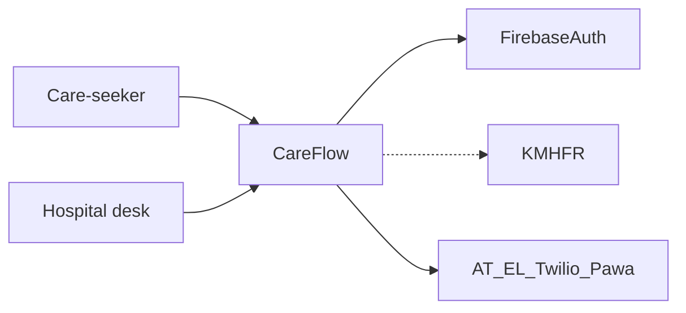
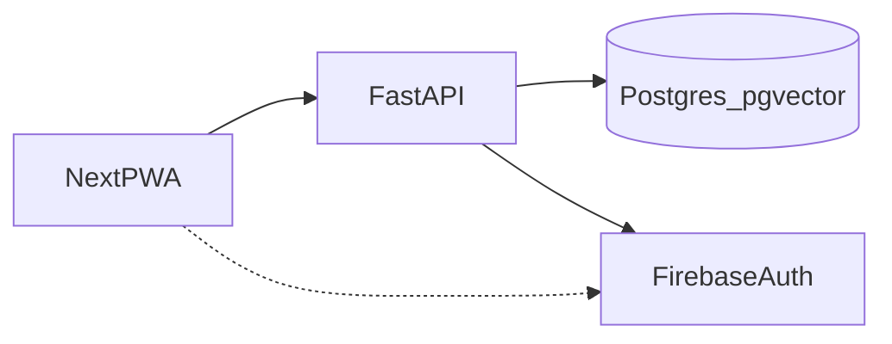
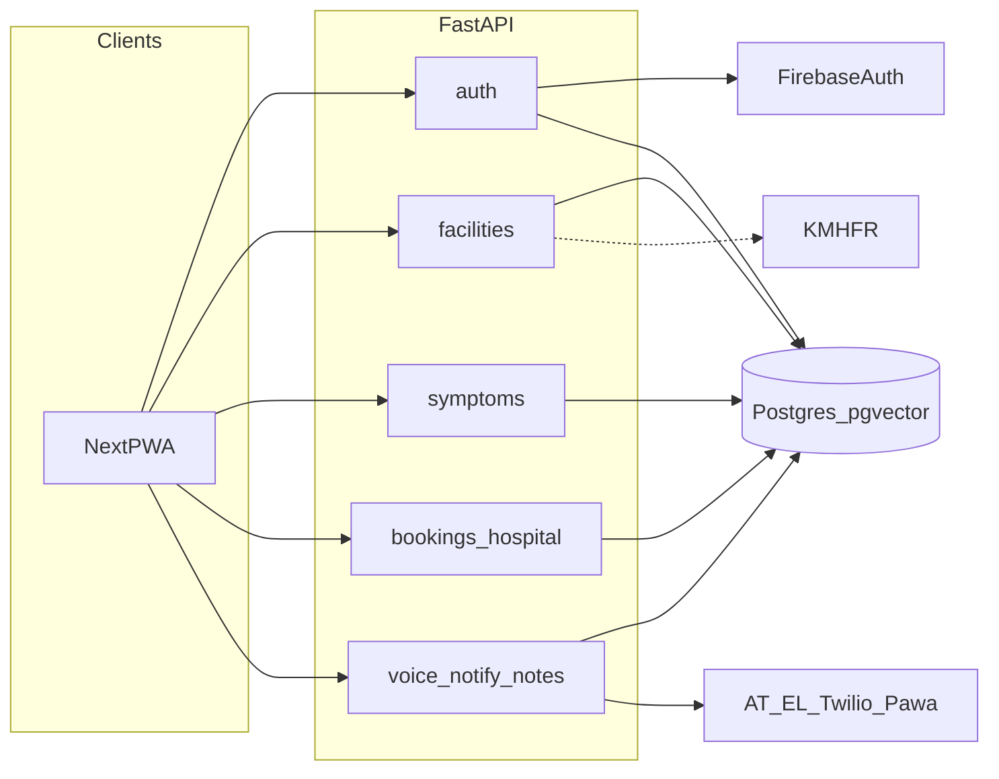

# CareFlow architecture

Kenya hospital **pretriage**: map symptoms to a KEPH level, recommend a facility (wait then distance), book, then SMS/voice. Not a medical device. Not SHA/AfyaKE.

This file is the **locked MVP target** from [plans/kenya-pretriage.md](plans/kenya-pretriage.md), with an explicit [as-built](#as-built-vs-target) table so readers do not assume symptoms, bookings, or notify exist in code. Domain “why” lives in [docs/product-map/](docs/product-map/); physical ER in [plans/product-schema.md](plans/product-schema.md). PlantUML: [ARCHITECTURE.puml](ARCHITECTURE.puml) (`context`, `containers`, `components`, `sequence_j1`, `deploy`).

## Context

Actors: **care-seeker** (`/patient`), **hospital desk / clinician** (`/hospital`; same login in MVP), **SMS + voice** (`+254`). Externals: Firebase Auth, [KMHFR](https://kmhfr.health.go.ke/public/facilities) (facility SoT), Africa’s Talking, ElevenLabs, Twilio, Pawa AI. Esri is QA/bootstrap only, not SoT.

Dashed KMHFR = live sync planned; first boot uses committed Nairobi seed. Full picture: puml `context`.

## Containers

One PWA origin (`/`, `/patient`, `/hospital`). FastAPI owns ranking and vendor keys (no `/v1` prefix). **PostgreSQL 16 + pgvector** is the only product store ([D-001](research/decision-log.md)); Firebase is auth only. CORS allowlist is `FRONTEND_ORIGIN`.

Dashed PWA→Firebase = client SDK planned (P3). Dual DB roles: `careflow` (requests, RLS) vs `careflow_owner` (Alembic). Puml: `containers`.

## Backend modules

Live packages under `backend/app/`: **`core`**, **`auth`**, **`facilities`**. Planned (P1–P5 in [plans/team-issues.md](plans/team-issues.md)): `symptoms`, `triage`, `bookings`, `hospital`, `notes`, `notify`, `voice`. Alembic `0001` already has the full product DDL.

GitHub Mermaid above is the target graph; puml `components` uses dashed borders and arrows for packages not yet in `main.py`.

## Trust and data

Bearer **Firebase ID token** on protected routes. Role (`patient` | `hospital_staff`) and staff `facility_id` live in `users`, keyed by `firebase_uid`. Demo UIDs: `demo-patient` / `demo-staff`. Unknown Firebase UIDs auto-provision as care-seekers (`role=patient`); hospital staff remain seeded (invite-only). RLS session GUCs (`app.user_id`, `app.role`, `app.facility_id`) isolate bookings/notes/notify — helpers exist in `core/rls.py`; Wave 2 routes will call them.

`GET /facilities/recommend` is **open** (auth ignored). `wait_count` is a **desk-typed** ranking input (and booking lifecycle increment/decrement), not an HMIS feed ([INV-16](docs/product-map/05-invariants.md)). Product-map still has an open question on bodies-in-room vs incoming ([04-queue-and-bookings.md](docs/product-map/04-queue-and-bookings.md)); this architecture follows the current spec: desk-typed `wait_count`.

## Request path

**Routine** ([INV-05](docs/product-map/05-invariants.md)–06, 08): utterance → catalog (`POST /symptoms/map`) → **rules** pick `keph_min` (embeddings never pick the hospital) → `keph_level >= keph_min` → lowest `wait_count` → nearest.

**Red flag** ([INV-07](docs/product-map/05-invariants.md)): ignore wait; nearest KEPH 4+; never a quieter distant Level 2. **Recommend today is routine or red-flag** via `red_flag` on `GET /facilities/recommend`.

**Notify** ([INV-13](docs/product-map/05-invariants.md)): voice/STT/TTS/SMS/call failure must not block booking — fail closed to text + SMS / `DEMO_NOTIFY` log.

Journeys J1–J9: [plans/user-journeys.md](plans/user-journeys.md). Target J1 sequence (map → rules → recommend → book → SMS → arrived): puml `sequence_j1`. Voice cascade: [kenya-pretriage.md](plans/kenya-pretriage.md) § Voice routing — do not copy the table here.

## Deploy

**Local:** [docker-compose.yml](docker-compose.yml) services `db` + `api`; PWA on the host (`next dev` `:3000`). **Staging (Render):** Blueprint [`exs-da91jphsrm7s73atarb0`](https://dashboard.render.com/blueprint/exs-da91jphsrm7s73atarb0) is applied on branch `dev` — **careflow-api** ([`https://careflow-api-y00r.onrender.com`](https://careflow-api-y00r.onrender.com), Docker, `GET /health` ok), **careflow-web** ([`https://careflow-web.onrender.com`](https://careflow-web.onrender.com), Node), **careflow-db** (Postgres 16, Oregon). Not production (do not claim NFR-AVAIL-01). Render MCP cannot create Docker web services; further API changes are git push to `dev` (after CI checks) or parent `trigger_deploy`. Push/`merge` to `dev` then GitHub Actions **CI / test** and **CI / lint** then Render `autoDeployTrigger: checksPass` — not a GitHub Actions deploy job, not production on `main`. `DEMO_NOTIFY=1`. Secrets: Phantom locally; dashboard `sync: false` (Firebase Admin on the API). Staging uses the same owner `connectionString` for `DATABASE_URL` and `DATABASE_ADMIN_URL` (dual `careflow` / `careflow_owner` + RLS is out of scope). Puml: `deploy`. Inventory and remaining human steps: [ONBOARDING.md](ONBOARDING.md#staging-render).

## As-built vs target

| Surface | As-built | Target |
|---------|----------|--------|
| `GET /health` | Live, no DB ping | Same |
| `GET /me` | Live; Firebase Admin; unknown UIDs auto-provision as care-seekers; staff remain seeded | Same |
| `GET /facilities/recommend` | Live; Nairobi seed, wait-then-distance, Kenya bbox; **`red_flag=true`** nearest KEPH 4+ | + KMHFR sync |
| Symptom catalog JSON | Live (`backend/data/kenya-symptoms.json`, 52 rows); DB seed helper not on boot yet | + embeddings + `POST /symptoms/map` |
| `POST /symptoms/map` | Handler in `symptoms/`; **not** in `main.py` (P1 handshake) | P2 + include_router |
| `POST /bookings`, hospital queue / wait / arrived / no-show | Create package unmounted; queue/arrived are P4 | P2 / P4 |
| `POST /voice/stt`, `/voice/tts`, notify, notes | Not in `main.py` | P5 |
| PWA `/` | Role picker; **no** J8 mic consent | J8 then role picker |
| PWA `/patient`, `/hospital` | Shells (disclaimer / 999 / placeholder) | Book + desk |
| Firebase **client** | None | P3 |
| `backend/app/{core,auth,facilities}` | Live | Same |
| `symptoms`, `triage`, `bookings`, `hospital`, `notes`, `notify`, `voice` | Planned | Per [team-issues.md](plans/team-issues.md) |
| Alembic `0001` | Full product DDL | Used by later packages |
| Compose `db` + `api` | Running locally | Same |
| Render + Next HTTPS | Staging live: careflow-api `https://careflow-api-y00r.onrender.com` (`GET /health` ok), careflow-web `https://careflow-web.onrender.com`, careflow-db Postgres 16 Oregon. Leftover static `careflow-sei7.onrender.com` not in Blueprint | Not production; remaining: Firebase authorized domain + optional static suspend |

HTTP chapters for live routes: [docs/api/](docs/api/). OpenAPI and Postman artefacts: [docs/api/README.md](docs/api/README.md).

## Related

| Doc | Role |
|-----|------|
| [plans/kenya-pretriage.md](plans/kenya-pretriage.md) | Locked MVP: KEPH, ranking, voice cascade, P1–P5 |
| [plans/product-spec.md](plans/product-spec.md) | Domain objects and HTTP stubs |
| [plans/product-schema.md](plans/product-schema.md) | Physical ER / DDL |
| [plans/user-journeys.md](plans/user-journeys.md) | J1–J9 |
| [docs/product-map/](docs/product-map/) | Domain map (not stack) |
| [docs/api/](docs/api/) | Live HTTP reference |
| [docs/research/postgresql-primary-store.md](docs/research/postgresql-primary-store.md) | D-001 ADR |
| [ONBOARDING.md](ONBOARDING.md) | Local Compose / Phantom / Render staging |
