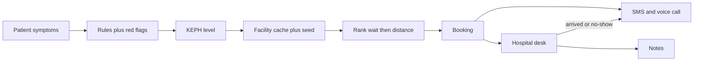

# Problem CareFlow is trying to solve

| Field | Value |
|-------|-------|
| Document type | Problem statement |
| Version | 0.1 |
| Status | Draft |
| Owner | camline |
| Last updated | 2026-08-28 |
| Related documents | [camlinedev.md](camlinedev.md), [02-current-state.md](02-current-state.md), [plans/kenya-pretriage.md](../plans/kenya-pretriage.md) |
| Prerequisites | [camlinedev.md](camlinedev.md) |
| Revision summary | First extraction from committed plans |

Previous: [camlinedev.md](camlinedev.md) · Next: [02-current-state.md](02-current-state.md)

## 1. The problem

Kenyan care-seekers often do not know **which level of facility they should go to**, or **which nearby facility they can reach with the shortest wait**. `[Verified]` in [plans/kenya-pretriage.md](../plans/kenya-pretriage.md) and [README.md](../README.md).

Without a pre-door routing step they tend to:

- Arrive at a facility that cannot handle the case (too low a KEPH level)
- Or crowd a higher-level hospital that should be reserved for more serious cases
- Or pick a nearby hospital with a long queue when a quieter, appropriate facility is closer in time

CareFlow's stated wedge is to sit **before the hospital door**: map symptoms to a KEPH level, recommend the nearest matching facility with the shortest hospital-reported wait, book, then remind the person by SMS and phone. `[Verified]`

It is **pretriage routing**, not a diagnosis. UI copy is required to say so. `[Verified]` in [plans/user-journeys.md](../plans/user-journeys.md).

## 2. Who feels it

| Actor | Role in the problem |
|-------|---------------------|
| Care-seeker | Person or family needing care. Kenyan `+254` phone. English and/or Kiswahili; may speak Gĩkũyũ, Dholuo, Kalenjin, Kikamba, or Kĩmĩĩrũ. May be blind or low-vision. `[Verified]` |
| Hospital desk | Same login as clinician in MVP. Owns the **people waiting** number that ranking uses. `[Verified]` |
| Hospital clinician | Marks arrived / did not come; writes notes. Sees only their facility. `[Verified]` |

There is no separate admin role in the described MVP. `[Verified]`

## 3. Intended loop

KEPH levels used in the plan: 2 dispensary, 3 health centre, 4 primary/county hospital, 5 regional referral, 6 national. `[Verified]`

Ranking rule: filter `keph_level >= keph_min`, then lowest `wait_count`, then nearest. A higher-level facility may take a lower-level case. Red flags ignore wait and send to the nearest KEPH 4+. `[Verified]`

## 4. What this product is not

These are explicit non-goals in the plans. `[Verified]`

- Diagnosis or a medical device
- SHA claims, AfyaKE, AfyaLink, or any HIE
- Pharmacy e-script networks
- Ambulance dispatch
- Clinician-to-clinician referral
- Inbound "call us to book" IVR
- Native iOS/Android apps (iteration 1 is one PWA)
- Live HMIS queues (wait is hospital-entered, not pulled from hospital systems)
- All 60+ Kenyan languages

The landscape claim: no public product currently does community symptoms → correct KEPH → nearest + shortest wait → booking → arrived/no-show → multimodal notes. `[Likely]` stated in the plan; the cited research scorecards are **not in the repo** (see [02-current-state.md](02-current-state.md)).

## 5. How we would know it worked

The plan's pitch-day demo is the only written success test. `[Verified]`

1. Voice-consent landing → mild symptoms → Level 3/4 nearby with lower wait → book → SMS or console log
2. A quieter facility ranks above a busier nearer one
3. Red-flag chest pain → nearest Level 4+, wait ignored
4. Hospital marks met → photo + voice note
5. Second patient marked no-show → SMS; reminder call logged or demo-dialled

There is no production KPI (time-to-right-facility, no-show rate, mis-level rate) in the committed files. `[Unverified]`

## 6. Geography and language constraints that shape the problem

- Kenya only: KMHFR facility identity, `+254` phones, counties. `[Verified]`
- UI / TTS / SMS / calls: English + Kiswahili. `[Verified]`
- Symptom synonyms also for Gĩkũyũ, Dholuo, Kalenjin, Kikamba. Spoken Kikuyu/Luo/Kamba/Meru use a Kenyan-language STT/TTS fallback. `[Verified]`
- Voice path on landing is required accessibility, not polish. Microphone starts only after consent. `[Verified]`
