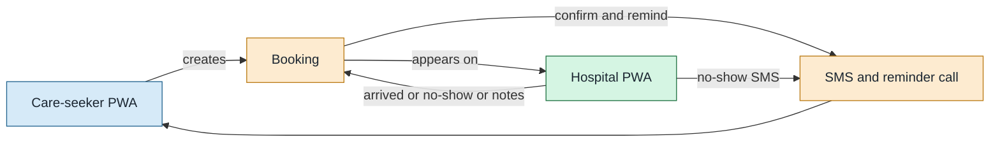
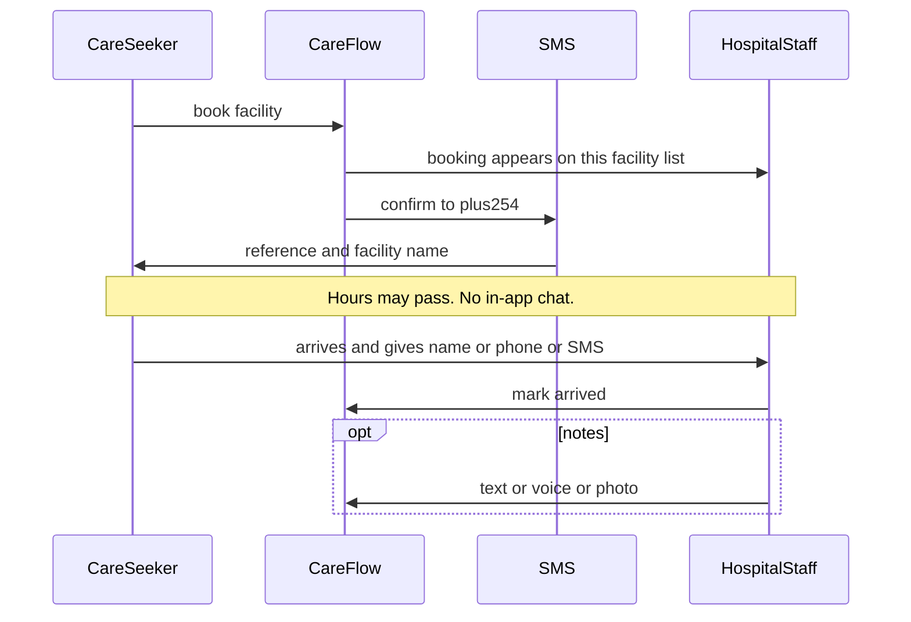

# Two sides of the product

| Field | Value |
|-------|-------|
| Document type | Product domain map |
| Version | 0.1 |
| Status | Draft |
| Owner | camline |
| Last updated | 2026-08-28 |
| Related documents | [01-language.md](01-language.md), [03-end-to-end.md](03-end-to-end.md) |
| Prerequisites | [01-language.md](01-language.md) |
| Revision summary | Care-seeker side, hospital side, and the booking as the join |

Previous: [01-language.md](01-language.md) · Next: [03-end-to-end.md](03-end-to-end.md)

## 1. Why two sides

CareFlow only works if **both** sides exist:

- The care-seeker must pick a **suitable** facility (right KEPH, not the loudest rumour) and commit to going.
- The hospital must say how busy it is, see who is coming, and close the loop (met / did not come).

If only the care-seeker side exists, wait numbers rot and ranking becomes a lie. If only the hospital side exists, people still guess where to go. The booking is the join.

One product, one origin, two roles from the marketing homepage (nav and footer CTAs). Voice consent is on `/patient`. Not two native apps. `[Verified]` in the product spec.

## 2. Care-seeker side

Job: **before the door**, get to the right level of facility with a tolerable wait.

| Step | What they do | Why it matters |
|------|----------------|----------------|
| Role | I need care (marketing nav or footer) | Same install as hospital; do not dump a desk UI on a sick person |
| Voice consent | Yes or no on `/patient` **before** the journey. Mic stays off until yes | Privacy. Low-vision path is required, not polish |
| Sign-in | Identity + `+254` phone | Booking and SMS need a person and a number |
| Disclaimer | Not a diagnosis; 999 / go now | Clinical-safety copy |
| Symptoms | Type or speak | Catalog mapping, then **rules** pick KEPH. Not an LLM diagnosis |
| Place | GPS or typed Kenyan place | Ranking needs where they are |
| Choose and book | Pick one ranked facility | Commitment. Hospital can see them coming |
| SMS / reminder | Stay informed without opening the app | Feature-phone family members can still hear the plan |
| Travel | Leave the app | CareFlow does not navigate the ward |

What this side is **not**: a doctor in the phone, SHA, ambulance, a chat with the receptionist.

## 3. Hospital side

Job: **at the door**, make wait honest, match a face to a booking, close the visit.

| Step | What they do | Why it matters |
|------|----------------|----------------|
| Role | Hospital | Same PWA, different session |
| Sign-in | Scoped to **one** facility | Must not see another hospital's list |
| People waiting | Type or correct the number | This is what **other** care-seekers' ranking uses |
| Today's bookings | Name or phone last-4, symptoms, status | How staff "connect" to the person: match at the desk, not chat |
| Mark met | Status `arrived` | Closes the incoming booking; notes can follow |
| Mark did not come | Status `no_show` | Frees expected load; SMS tells them to rebook |
| Notes | Text, voice, photo | For other staff at **this** facility. Invisible to the care-seeker |

Desk and clinician are the **same login** in this pass. There is no separate receptionist system. `[Verified]`

## 4. How receptionist and care-seeker connect

They do **not** share a live chat, a video call, or a map pin of the person walking in.

They share **one booking**:

Matching rule (stated, not implemented): staff find the row using **name, phone last-4, or the SMS reference**, then mark met. If they cannot match, the person is treated as a **walk-in** (see [04-queue-and-bookings.md](04-queue-and-bookings.md)). `[needs validation]`

## 5. What each side sees of the other

| | Care-seeker sees | Hospital staff see |
|--|------------------|-------------------|
| Identity | Facility name, KEPH, wait count, map link, booking reference | Name or phone last-4, symptoms summary, status |
| Notes | Nothing | Notes for their facility |
| Other facilities | Ranked list before they book | Nothing. Own facility only |
| Walk-ins | Nothing | Only as part of the wait number they type, not as named rows |

That last row is the product's honesty constraint: CareFlow names **bookings**, not everyone in the waiting room.
