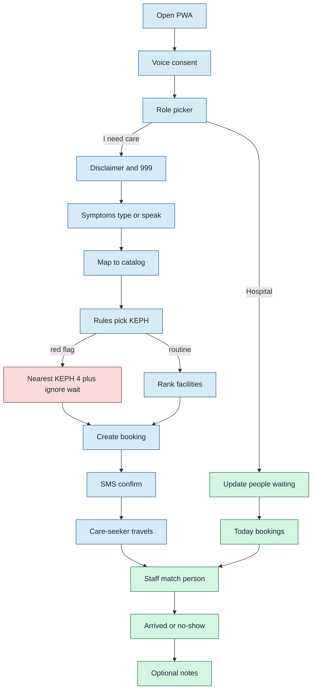
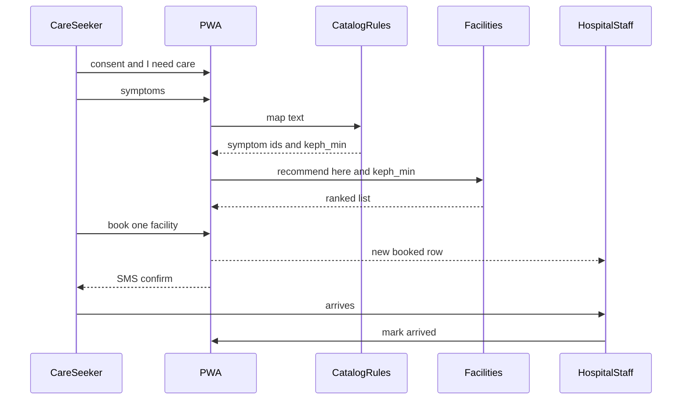
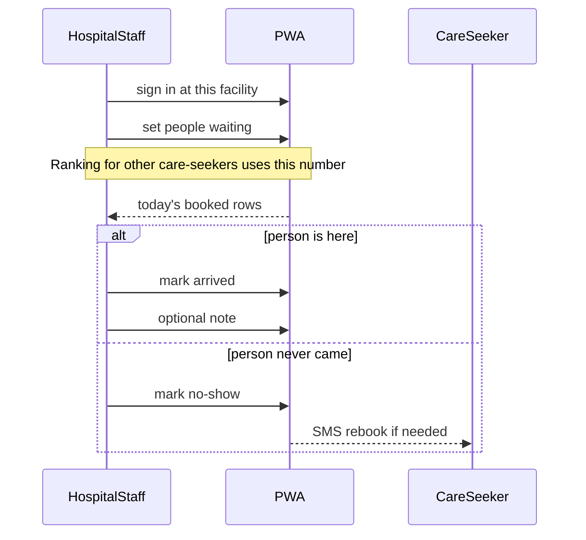

# End-to-end loop

| Field | Value |
|-------|-------|
| Document type | Product domain map |
| Version | 0.1 |
| Status | Draft |
| Owner | camline |
| Last updated | 2026-08-28 |
| Related documents | [02-two-sides.md](02-two-sides.md), [04-queue-and-bookings.md](04-queue-and-bookings.md) |
| Prerequisites | [02-two-sides.md](02-two-sides.md) |
| Revision summary | Full loop visuals and why each stage exists |

Previous: [02-two-sides.md](02-two-sides.md) · Next: [04-queue-and-bookings.md](04-queue-and-bookings.md)

## 1. The loop in one picture

Red-flag path still **allows** a booking so the facility can see them coming. It must not send them to a quiet distant Level 2. `[Verified]`

## 2. Why each stage exists

| Stage | If we skip it |
|-------|----------------|
| Voice consent first | Mic on without permission; low-vision users never get a path |
| Disclaimer / 999 | Product looks like a diagnosis app; emergencies wait on ranking |
| Catalog + rules, not free-text "diagnosis" | We cannot defend KEPH choice; vectors must not pick the hospital |
| Rank wait then distance | Everyone still piles into Kenyatta or the nearest rumour |
| Booking | Hospital cannot tell a CareFlow arrival from a stranger |
| SMS | Family on a basic phone never gets the plan |
| Staff mark arrived / no-show | Wait numbers and "today's list" never close; ranking drifts |
| Staff-typed wait | Walk-ins (the majority today) are invisible to ranking |

## 3. Care-seeker happy path (routine)

## 4. Hospital happy path

## 5. What "done" looks like for one visit

A visit is done when the booking is **arrived**, **no_show**, or **cancelled**. Until then it is incoming load.

The **physical** waiting room is not done when CareFlow is done: walk-ins remain. CareFlow does not empty a county hospital by existing. It only steers **new** care-seekers and accounts for **named** bookings.

Next: how those two crowds relate, and what the plans currently do to `wait_count`.
