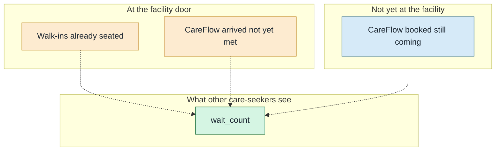
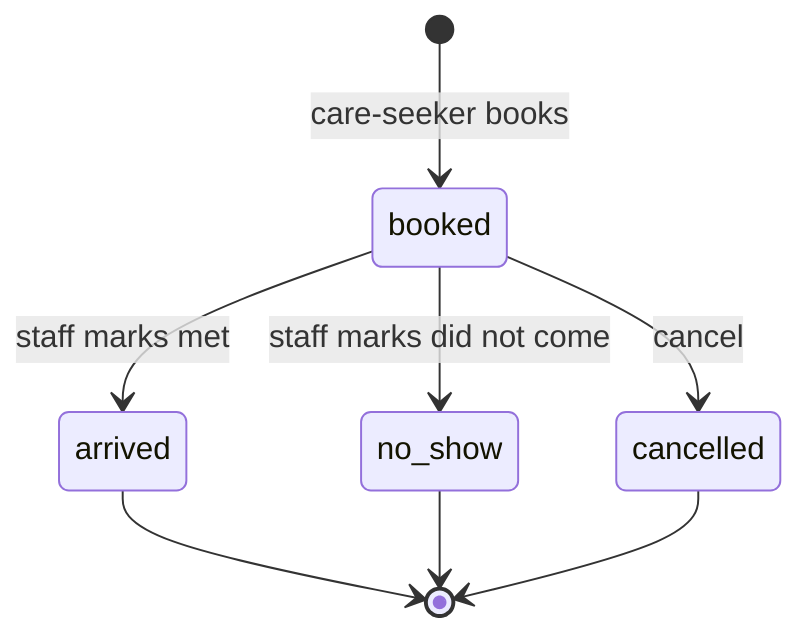

# Queue, bookings, cancel, no-show

| Field | Value |
|-------|-------|
| Document type | Product domain map |
| Version | 0.1 |
| Status | Draft |
| Owner | camline |
| Last updated | 2026-08-28 |
| Related documents | [03-end-to-end.md](03-end-to-end.md), [05-invariants.md](05-invariants.md) |
| Prerequisites | [03-end-to-end.md](03-end-to-end.md) |
| Revision summary | Walk-ins vs bookings, wait_count tension, appointments, cancel |

Previous: [03-end-to-end.md](03-end-to-end.md) · Next: [05-invariants.md](05-invariants.md)

## 1. Two crowds at the same door

This is the part the plans blur. A real Kenyan OPD has people **already sitting there**. CareFlow also has people **still at home** who tapped Book.

| Crowd | Named in CareFlow? | Can we re-route them? | How they affect ranking |
|-------|--------------------|----------------------|-------------------------|
| Walk-ins already there | No | No. They are already in the room | Only if staff type them into wait count |
| CareFlow booked, still at home | Yes | They chose a facility; we can cancel or they can pick another later | Plans: creating a booking **increments** wait count |
| CareFlow arrived, not yet seen | Yes | No. They are here | Plans: marking arrived **decrements** wait count |

**Important:** CareFlow does not reshuffle people already in the queue. It tries to keep the **next** care-seeker from joining the worst line. Walk-ins keep their place. That is why the desk number matters: it is the only way the physical crowd enters ranking.

## 2. What the plans say wait_count does

From [product-spec.md](../../plans/product-spec.md): staff can PATCH wait count; create booking increments; arrived and no-show decrement.

That implies wait_count is treated like **expected CareFlow load**, plus whatever staff typed.

That fights J4's English: "people waiting" as the crowd you can see.

| Reading | Increment on book? | Decrement on arrived? | Walk-ins |
|---------|--------------------|-----------------------|----------|
| A. Incoming load (expected arrivals) | Yes | Yes (they are no longer incoming) | Staff must add them by hand or they vanish from ranking |
| B. Bodies in the waiting room | No (person is not there yet) | No on arrived; decrement when **seen and leaving** | Staff typed number is the source of truth |
| C. Demo hybrid (what the spec wrote) | Yes | Yes | Staff override exists, meaning is muddy |

`[needs validation]` Pick A, B, or a named hybrid before high-level design. Until then, do not build ranking as if it were a live HMIS queue (non-goal NG-02).

Recommended for a first honest product: **B for the displayed "people waiting"**, plus a **separate** count of `booked` rows so staff can see who is coming. Ranking can use people-waiting first, incoming bookings as a secondary signal. That is a design choice. It is not locked.

## 3. Appointments: there is no clinic diary yet

J9 talks about a reminder at "T minus 2 hours". The booking object lists status and timestamps, **not** a chosen slot (14:30 with Dr X).

So in the written product, a booking is:

- **Intent to come** to this facility, after pretriage
- Not a reserved chair in a schedule
- Not "you will be seen at 14:30 ahead of walk-ins"

`[needs validation]` Decide:

| Option | Meaning | Reminder | Fairness with walk-ins |
|--------|---------|----------|------------------------|
| Come-when-you-can (today) | No clock time | "Your facility is X; go when you can" / maybe none | Walk-ins and CareFlow sit in the same physical line |
| Timed visit | Booking has `due_at` | T minus 2 hours works | Must say whether a timed booking jumps the walk-in line (almost certainly **no** for this pass) |
| Window (morning / afternoon) | Coarse slot | Remind at window start | Still no queue-jump |

Recommended: **come-when-you-can** for the first pass. Keep J9 as an optional "still coming?" ping, not a calendar. Do not promise skip-the-line. That promise would punish walk-ins and needs hospital policy we do not have.

## 4. Cancel and no-show

| Event | Who triggers it in the plans | Care-seeker | Staff | Wait count in the spec |
|-------|------------------------------|-------------|-------|------------------------|
| Book | Care-seeker | Sees reference | New row `booked` | Increment |
| Arrived / met | Staff, when the person is in front of them | No extra SMS required | Row `arrived`; notes optional | Decrement |
| No-show | Staff, when they never came | SMS: marked not arrived, rebook if needed | Row `no_show` | Decrement |
| Cancel | Status exists; **who** is unspecified | Should they cancel from the PWA? | Should staff cancel a duplicate? | Unspecified. If book incremented, cancel should decrement |

`[needs validation]` Care-seeker-initiated cancel should exist. Otherwise a person who went elsewhere forever occupies expected load.

No-show is **not** cancel. No-show is staff testimony after the fact. Cancel is an explicit "I will not come" before the visit is closed.

## 5. Matching a person at reception

Staff connect to the care-seeker only at the desk:

1. Person (or family) arrives with SMS or a name.
2. Staff search today's `booked` rows: name, phone last-4, reference.
3. Hit: mark **met**. They join the physical line like everyone else unless the facility has a local policy we do not encode.
4. Miss: treat as **walk-in**. Do not invent a booking at the door in this pass. `[needs validation]`
5. Duplicate faces (two bookings, one person): staff cancel or no-show the extra row. `[needs validation]`

Staff never "call" the care-seeker through CareFlow except the **outbound reminder** the system already scheduled. There is no inbound IVR to book (non-goal).

## 6. Staff and many people waiting

If the waiting room is already full:

- New CareFlow ranking should **steer others away** (higher wait count).
- People already seated stay seated. We do not send them an SMS to leave.
- Staff can raise wait count immediately so the next care-seeker in Kawangware does not add themselves.
- Bookings already `booked` still stand. Staff do not mass-cancel because the room is full unless we add a "facility closed / not taking more" action (out of scope until asked).

If the facility should stop taking CareFlow bookings: that is a **closed / not accepting** flag we do not have. `[needs validation]` Without it, ranking will keep sending people to a full Level 4 if staff forget to inflate wait count.
