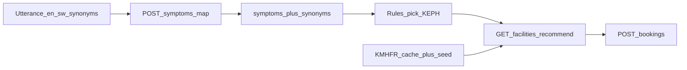

# P2 task map — Facilities, KMHFR, symptoms, later bookings

| Field | Value |
|-------|-------|
| Document type | Personal working map (P2) |
| Version | 0.1 |
| Status | Draft |
| Owner | Moses (P2) |
| Last updated | 2026-08-29 |
| Related documents | [p2-decisions.md](p2-decisions.md), [p2-wave1-plan.md](p2-wave1-plan.md), [team-issues.md](../plans/team-issues.md), [kenya-pretriage.md](../plans/kenya-pretriage.md), [product-spec.md](../plans/product-spec.md), [product-schema.md](../plans/product-schema.md), [user-journeys.md](../plans/user-journeys.md), [merge-clash-avoidance.md](../plans/merge-clash-avoidance.md), [ARCHITECTURE.md](../ARCHITECTURE.md), [decision-log.md](../research/decision-log.md) |
| Prerequisites | Wave 0 baseline on `dev` / `main` (already landed) |
| Revision summary | §4 as-built: red-flag live; map and bookings unmounted |

This is a map, not an approved implementation plan. Wave 1 phases and locked defaults: [p2-wave1-plan.md](p2-wave1-plan.md), [p2-decisions.md](p2-decisions.md).

## 1. What P2 is

CareFlow is Kenya hospital **pretriage**: map what the care-seeker said to a catalog symptom, let **rules** pick a KEPH floor, recommend a facility (wait then distance), then book. It is not a diagnosis product and not SHA/AfyaKE.

**Moses owns the middle of that loop** (data + ranking + later booking create). Andrew (P3) owns the care-seeker PWA. Joseph (P4) owns the desk and wait **decrement**. Brian (P5) owns SMS/voice/notes. Ethan (P1) owns hubs (`main.py`, config, Alembic, lockfiles).

| Wave | P2 delivers | P2 waits |
|------|-------------|----------|
| **1** (now) | KMHFR-shaped facility cache + ranking; Kenya symptom catalog + `pgvector`; `POST /symptoms/map` | Live KMHFR until scorecards exist (see §8). No bookings. |
| **2** (later) | `backend/app/triage/` rules package; `POST /bookings` that **increments** `wait_count` | P4 decrement, P3 book UI, P5 notify |

Issue title: `[P2] KMHFR ingest, ranking, Kenya symptom catalog + pgvector; Wave 2 bookings`.

## 2. Locked stack

Do not invent another stack. D-001 is locked: PostgreSQL 16 + pgvector is the only product store. Firebase is auth only.

| Layer | Choice | Where it lives |
|-------|--------|----------------|
| API | FastAPI, Python 3.12, no `/v1` prefix | `backend/` |
| PWA | Next.js 15.5, React 19, Tailwind 4 | `frontend/` (P3/P4; **P2 does not touch**) |
| DB | PostgreSQL 16 + pgvector; `cube`/`earthdistance` for metres | Compose `db` |
| Auth | Firebase ID token; FastAPI verifies | `backend/app/auth/` (P1) |
| Local run | Docker Compose `db` + `api`; PWA on host `:3000` | [ONBOARDING.md](../ONBOARDING.md) |
| Symptom vectors | `intfloat/multilingual-e5-small`, dim **384**, cosine, HNSW | Schema §4; **not** in `pyproject.toml` yet |
| Facility SoT (product) | [KMHFR](https://kmhfr.health.go.ke/public/facilities) (~17k, cache + seed) | Esri is QA only, never SoT |

Current API deps (`backend/pyproject.toml`): FastAPI, uvicorn, pydantic-settings, SQLAlchemy 2, psycopg, Alembic, firebase-admin, httpx. **No** embedding library yet. Adding one is a **handshake to P1**, not a local edit of `pyproject.toml`.

## 3. Product loop (P2 slice)

**Hard split:** embeddings map text → `symptom_id`. Rules (catalog `keph_min` / `red_flag`) pick the hospital **level**. Vectors never pick the facility.

Routine (INV-06): `operational AND keph_level >= keph_min`, then `wait_count ASC`, then nearest.

Red flag (INV-07): ignore wait; nearest KEPH 4+; never a quieter distant Level 2.

## 4. What is already built (do not rebuild)

Wave 0 baseline is on this branch. Handover rule: start from it.

| Surface | Status | Path |
|---------|--------|------|
| Compose + pgvector Postgres | Live | `docker-compose.yml` |
| `GET /health`, `GET /me` | Live | `backend/app/core/health.py`, `backend/app/auth/` |
| Alembic `0001` | **Full product DDL** including `facilities`, `symptoms`, `symptom_synonyms`, `bookings` | `backend/alembic/` |
| Nairobi seed + routine recommend | Live (J7) | `backend/app/facilities/`, `backend/data/nairobi-facilities.json` |
| PWA shells | Live | `frontend/` (not ours) |
| `POST /symptoms/map` | Handler in package; **not** in `main.py` | P1 handshake |
| `POST /bookings` | Handler in package; **not** in `main.py` | P1 handshake |
| Red-flag ranking | **Implemented** (`red_flag` query, seed only) | Same + KMHFR rows later |
| Live KMHFR sync | **Not** implemented | Seed only; `source` enum already has `kmhfr` |
| `symptoms/`, `bookings/` packages | **Present** (unmounted) | P1 `include_router` |
| `triage/` package | **Present** (rules only, no HTTP) | Map and book import `app.triage.rules` |
| Embedding extra | **Absent** | Handshake P1 when seeding e5-small |

Recommend today: Kenya bbox, `keph_min` 2–6, wait then `earth_distance`, empty-table Nairobi seed. Auth ignored (public). Seed codes look like `SEED-NBO-KNH`, not live KMHFR codes.

## 5. Owns / does not touch / handshake

**Write (Wave 1):** `backend/app/facilities/`, `backend/app/symptoms/`, unit tests under those packages, `docs/api/facilities.md` (extend), `docs/api/symptoms.md`.

**Write (Wave 2):** `backend/app/triage/`, `backend/app/bookings/`, `docs/api/bookings.md`, tests under those packages.

**Do not touch:** Esri as SoT, `frontend/`, notes, notify, ElevenLabs/Pawa, hubs listed below, `backend/tests/` (Tester owns smoke), `frontend/e2e/`. Do not **decrement** `wait_count` (P4).

| Hub | Owner | P2 action |
|-----|-------|-----------|
| `backend/app/main.py` | P1 | Export `router`; request `include_router` |
| `backend/app/core/**`, `.env.example` | P1 | Request Settings names (embedding model, KMHFR token if any) |
| `backend/pyproject.toml` | P1 | Request embedding extra (e.g. sentence-transformers / onnx) |
| `backend/alembic/**` | P1 | Do not add `0002`. Only if dim changes: give P1 a SQL snippet |
| `docs/api/README.md` route map | P1 | Request rows; we write domain chapters only |

Handshake note shape for Ethan: **file**, **one-line change**, **why** (journey or acceptance line).

## 6. Journeys that bind P2

| Journey | P2 steps | Notes |
|---------|----------|-------|
| **J1** routine | Steps 4–6: rules KEPH, recommend wait-then-distance, book | Book is Wave 2. Map + recommend are Wave 1. |
| **J2** red flag | Skip wait; nearest KEPH 4+; booking still allowed | Ranking change is Wave 1. Book Wave 2. |
| **J7** first-boot recommend | Seed path already works | Extend, do not replace, until KMHFR is live. |
| **J8** voice mapping | Backend maps transcript → catalog via pgvector | STT itself is P5. We consume **text**. |

P3 Wave 1 is text symptom → recommend (no book until our `POST /bookings` exists).

## 7. Domain and HTTP P2 must implement

### 7.1 Facilities

`kmhfr_code`, `name`, `keph_level` 2–6, `lat`/`lng` (Kenya bbox, drop nulls), `county`, `operational`, `wait_count` (desk-typed, **not** HMIS, **not** queue position), `source` `seed` \| `kmhfr`, `synced_at`.

Live route to **extend**: `GET /facilities/recommend?lat=&lng=&keph_min=` ([docs/api/facilities.md](../docs/api/facilities.md)).

Missing: red-flag mode (distance only, KEPH ≥ 4). Spec does not yet name the query flag; that is a Wave 1 contract we must lock with P3 before coding.

### 7.2 Symptoms

Canonical catalog ~100–200 rows: `slug`, `keph_min`, `red_flag` (red flag implies `keph_min >= 4`), optional ICD-11 / CIEL ids.

Synonyms: langs `en`, `sw`, `ki`, `luo`, `kln`, `kam`; phrase + L2-normalized `vector(384)`; model must match app config or refuse `/symptoms/map`.

Planned: `POST /symptoms/map` `{ "text", "lang" }` → `symptom_id[]` + scores, **patient** auth in the spec. Acceptance: map above a **confidence floor** (floor value is not named in the spec).

Open ontologies (ICD-11, CIEL) are **codes and synonym seeds**, not the engine. No SNOMED dependency, no BODHI-S, no Pinecone/Weaviate.

### 7.3 Triage (Wave 2 package; behaviour may start in map)

`MAX(keph_min)` across mapped symptoms, with red-flag lift to ≥ 4. Snapshot `keph_min_applied` / `red_flag_applied` onto the booking at create time (catalog can change later).

Team-issues put `triage/` in Wave 2, but Wave 1 acceptance still says “rules pick KEPH”. Likely Wave 1 returns `keph_min` + `red_flag` on the map response (or a thin helper in `symptoms/`), then Wave 2 extracts `backend/app/triage/`. Confirm in planning.

### 7.4 Bookings (Wave 2 only)

Instant / walk-in only (`booking_kind=instant`, `booking_channel=ranked_recommend`). Same transaction:

1. `SELECT facilities … FOR UPDATE`
2. Insert `bookings` + `booking_instant` + ≥1 `booking_symptoms` + `booking_facility_snapshots`
3. `wait_count = wait_count + 1`

Do not insert `booking_appointments`. Do not decrement. Do not store `symptom_ids[]` (use `booking_symptoms`). Notify failure must not block the insert (INV-13); P5 owns send.

## 8. Research blockers (read before ingest)

Team-issues and kenya-pretriage both say: read `datasource-scorecard.md` and `symptom-ontology-scorecard.md` before ingest.

**Those files are not in the repo.** `research/big-picture/` has only the empty INDEX. `research/decision-log.md` locks **D-001** (Postgres) only. There is **no** D-00x row that locks KMHFR as SoT, even though the feature plan already names KMHFR as SoT.

Kenya-pretriage hard rule: **no live `facilities/` sync** until the datasource scorecard exists **and** the decision log locks the SoT. KMHFR public API token path is `[needs validation]`.

Tester (Kalungu) owns scorecard expansion. P2 should not invent a second SoT. Practical Wave 1: keep J7 seed, design KMHFR field mapping, do **not** hit live KMHFR until T’s scorecards land **or** the team explicitly waives the hard rule.

## 9. Clash contracts that will bite us

- **Wait increment** is ours. **Wait decrement** and desk `PATCH` are P4. Same `wait_count` column, different files.
- Recommend stays public today. Map is public in Wave 1 (D-P2-04); patient auth waits for Wave 2.
- Feature unit tests live under `backend/app/<pkg>/tests/`. Never add files under `backend/tests/`.
- Seed recommend already exists: **extend**, do not replace the J7 path until KMHFR is live.
- No `/v1`. No second facility schema. No LLM diagnosis.

## 10. As-built vs P2 target

| Surface | As-built | P2 target |
|---------|----------|-----------|
| Routine recommend | Live, seed | Same + optional KMHFR rows when ingest is allowed |
| Red-flag recommend | **Implemented** (`red_flag` query, seed only) | Same + KMHFR rows later |
| Symptom catalog | 52-row JSON + validators + empty-table seed | Embeddings + map API |
| `POST /symptoms/map` | Handler in package; not mounted | P1 include_router |
| Rules → KEPH | `app.triage.rules` used by map and book | Same |
| KMHFR sync | Missing | Cache + seed fallback; Esri not SoT |
| `POST /bookings` | Handler in package; not mounted | P1 include_router |
| Embedding dep + Settings | Missing | Handshake P1 |

## 11. Draft phase sketch (not approved)

This is the shape I would take into planning. Not a licence to code.

| Phase | Objective | Blocked by |
|-------|-----------|------------|
| **A. Contracts** | Lock map request/response, confidence floor, red-flag query on recommend, map auth | None |
| **B. Symptoms catalog** | Committed catalog JSON + embed job writing `symptoms` / `symptom_synonyms`; package tests | A; P1 embedding extra |
| **C. `POST /symptoms/map`** | Router + cosine search + refuse on model mismatch; `docs/api/symptoms.md`; handshake include_router | B |
| **D. Ranking** | Red-flag path on existing recommend; keep J7 seed; extend `docs/api/facilities.md` | A (query flag) |
| **E. KMHFR ingest** | Sync job + `source=kmhfr`; Kenya-only; drop null coords | Scorecards + D-00x, **or** explicit waiver |
| **F. Wave 2 triage** | Extract rules module; snapshot fields for book | C |
| **G. Wave 2 bookings** | `POST /bookings` + wait +1 + snapshot; handshake include_router | F; auth `/me` |

Wave 1 parallel split from the issue: `facilities/` (D, E) vs `symptoms/` (B, C). Do not start F/G on day one.

## 12. Open decisions for the planning round

1. **KMHFR:** wait for T’s scorecards, or Wave 1 seed-only with ingest designed but gated?
2. **Confidence floor:** numeric threshold for `/symptoms/map` (not in spec).
3. **Red-flag recommend:** new query `red_flag=true` vs separate path vs `keph_min` forced to 4 plus sort change?
4. **Map auth:** enforce patient Bearer in Wave 1, or match recommend (open) until P3 Firebase client is stable?
5. **Rules package:** thin fields on map in Wave 1, or create `triage/` early?
6. **Catalog source:** who drafts the 100–200 Kenya symptoms + `keph_min` / red flags (MoH KEPH guidelines as rules, not embeddings)?
7. **Embedding runtime:** CPU sentence-transformers in the API vs precomputed vectors only at seed time (API then only does SQL `<=>`)?

## 13. Attach in every P2 coding session

[merge-clash-avoidance.md](../plans/merge-clash-avoidance.md), [team-issues.md](../plans/team-issues.md) §P2, [user-journeys.md](../plans/user-journeys.md), [product-spec.md](../plans/product-spec.md), [docs/api/AGENTS.md](../docs/api/AGENTS.md).

## 14. Next

Wave 1 packages are on `origin/dev` (map and bookings unmounted). Handshake is copy-paste ready. Next session: [START-HERE.md](START-HERE.md).
